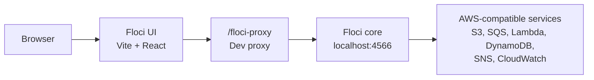

# Floci UI

Floci UI is a local web console for [Floci](https://github.com/floci-io/floci), the free local AWS emulator.

It is designed to feel familiar to AWS Console users while staying honest about the current implementation: the UI only renders real data returned by Floci-compatible APIs. If a service or operation is not wired yet, the screen stays empty or shows an explicit placeholder. No fake resources, demo rows, or mock service data are shown in normal mode.

## Why Floci UI?

Floci exposes AWS-compatible APIs on `http://localhost:4566`. That is ideal for SDKs, CLI scripts, and automated tests, but day-to-day local development also needs a visual layer:

- See which Floci server the UI is connected to.
- Browse real local AWS resources without leaving the browser.
- Inspect service state without inventing resources.
- Use CloudWatch logs and metrics as the telemetry surface.
- Keep unsupported screens explicit instead of hiding gaps behind dummy data.

## Relationship to Floci Core

Floci core is the emulator. Floci UI is only the console layer.



The UI does not create custom backend endpoints. It talks to Floci using AWS-compatible protocols:

| Protocol | Used by |
|---|---|
| REST XML | S3 |
| AWS Query | SQS, SNS |
| AWS JSON 1.0 | DynamoDB, CloudWatch Metrics |
| AWS JSON 1.1 | CloudWatch Logs |
| REST JSON | Lambda |

## Current UI Status

These percentages describe UI coverage for the connected Floci service, not backend completeness. Floci core supports more operations than this UI currently exposes.

| Service | UI coverage | Current UI status |
|---|---:|---|
| S3 | 95% | Full bucket and object lifecycle. List, create, delete buckets. Browse objects by prefix with folder navigation. Upload, download, delete, bulk-delete, and copy objects. Read object metadata and tags. Read/update bucket tags and versioning. |
| DynamoDB | 95% | Full table lifecycle. List, describe, create, delete tables. Scan with configurable limit. Query by partition key with sort-key operators. Create, edit, and delete items via JSON editor. Key schema badges and typed value rendering. |
| SQS | 95% | Full queue lifecycle. List, create, delete, purge queues. FIFO and content-based deduplication support. Send messages. Peek messages. Delete individual messages. Inline purge confirmation. |
| Lambda | 90% | Full function detail. List functions, filter by name or runtime. Detail drawer with runtime, state, architecture, ARN, handler, memory, timeout, code size, environment variables. Invoke with JSON payload, response display, and log tail. Delete function. |
| SNS | 90% | Full topic lifecycle. List, create (standard and FIFO), delete topics. List and manage subscriptions per topic (sqs, lambda, http, https, email, sms). Subscribe and unsubscribe endpoints. Publish messages with optional subject. |
| CloudWatch | 90% | Full log management. List, filter, create, delete log groups with retention policy. List and delete log streams. Browse and search log events. Rich parsing of Floci ingestor events into HTTP method/status/latency rows. List metrics and alarms. Auto-refresh every 10 s. |

Connected services today:

- CloudWatch
- S3
- SQS
- Lambda
- DynamoDB
- SNS

Placeholder services today:

- Secrets Manager
- Cognito
- RDS
- ElastiCache
- IAM
- Systems Manager
- KMS

## Service Detail

### S3 — 95%

Implemented:

- List buckets.
- Create bucket.
- Delete bucket.
- Browse objects by prefix.
- Folder-style navigation and breadcrumb.
- Create folder placeholders.
- Upload objects.
- Download objects.
- Delete one object.
- Delete multiple selected objects (bulk bar).
- Copy objects.
- Read object metadata (content type, size, ETag, cache-control, encoding).
- Read and update object tags.
- Read and update bucket tags.
- Read and update bucket versioning.

Remaining gaps:

| Feature | Floci API availability |
|---|---|
| Object version browser | Versioning is enabled via UI but listing individual versions is not yet wired |
| Bucket policy management | Available in core if S3 policy endpoints are enabled |
| Presigned URL workflow | Available through AWS-compatible S3 behavior |
| Multipart upload UI | Available in core, not exposed in UI |

### DynamoDB — 95%

Implemented:

- List tables.
- Create table (partition key, optional sort key, PAY_PER_REQUEST or PROVISIONED billing).
- Delete table.
- Describe table metadata (status, item count, size, billing mode, key schema).
- Key schema badges (HASH in amber, RANGE in purple).
- Scan table items with configurable limit.
- Query by partition key with sort-key operators (=, <, <=, >, >=, begins_with, between).
- Dynamic column rendering with typed values (numbers in green, booleans in blue).
- Create item via JSON editor.
- Edit item via JSON editor.
- Delete item with inline confirmation.
- Client-side search filter across all visible rows.

Remaining gaps:

| Feature | Floci API availability |
|---|---|
| TTL view and update | `DescribeTimeToLive` / `UpdateTimeToLive` |
| Batch write and bulk delete | `BatchWriteItem` |
| GSI / LSI management | `UpdateTable` |
| UpdateItem (partial update) | `UpdateItem` — current edit uses PutItem which replaces the full item |

### SQS — 95%

Implemented:

- List queues.
- Create queue (standard and FIFO, content-based deduplication, visibility timeout, retention period).
- Delete queue with inline confirmation.
- Purge queue with inline amber warning.
- Select queue and read attributes.
- Show message counts.
- Show configuration (visibility timeout, retention, max message size, FIFO, receive wait).
- Send message.
- Peek messages without consuming them.
- Delete individual messages after peek.

Remaining gaps:

| Feature | Floci API availability |
|---|---|
| Send message batch | `SendMessageBatch` |
| Queue tags | `ListQueueTags` / `TagQueue` / `UntagQueue` |
| Dead-letter queue configuration UI | `GetQueueAttributes` / `SetQueueAttributes` |

### Lambda — 90%

Implemented:

- List functions.
- Filter by name or runtime.
- Function card grid with runtime, state, handler, memory, timeout, code size, and last modified.
- Detail drawer with "Details" and "Invoke" tabs.
- Details tab: runtime badge, state badge, architecture badge, stateReason, full configuration meta-grid, ARN, role, environment variables table.
- Invoke tab: JSON payload editor, invoke button, response display (HTTP status, function error, execution duration), log tail collapsible.
- Delete function with inline confirmation in the drawer footer.

Remaining gaps:

| Feature | Floci API availability |
|---|---|
| Create function | `CreateFunction` |
| Event source mappings | `ListEventSourceMappings` |
| Aliases | `ListAliases` |
| Versions | `ListVersionsByFunction` |
| Link to CloudWatch log group | CloudWatch log groups (by convention `/aws/lambda/{name}`) |

### CloudWatch — 90%

Implemented:

- List log groups with prefix filter.
- Create log group with optional retention policy.
- Delete log group with inline confirmation.
- Log group list shows stored bytes, creation time, and retention badge.
- List streams for a selected group.
- Delete log stream with inline confirmation.
- Browse log events for a selected stream.
- Search events by message content.
- Rich log event rendering: Floci ingestor JSON events are parsed into HTTP method badge, path, action, status code badge, and latency.
- List metrics table (namespace, metric name, dimensions).
- List alarms table (name, state, metric) with expandable overflow.
- Auto-refresh logs, streams, and events every 10 s.
- Contextual header: shows group name and "ingestor" badge when a `/floci/*` group is selected; back arrow to return to overview.
- CloudWatch ingestor: automatically captures all Floci API calls into `/floci/{service}` log groups as the user navigates the console.

Remaining gaps:

| Feature | Floci API availability |
|---|---|
| Metric graphing | `GetMetricStatistics` / `GetMetricData` |
| Alarm creation and edit | `PutMetricAlarm` |
| Create log stream from UI | `CreateLogStream` — streams are currently created by the ingestor only |
| Manual PutLogEvents from UI | `PutLogEvents` |

### SNS — 90%

Implemented:

- List topics with name filter.
- Create topic (standard and FIFO, auto-appends `.fifo` suffix).
- Delete topic with inline confirmation.
- Select topic and manage subscriptions.
- List active subscriptions per topic (protocol badge, endpoint).
- Subscribe endpoint with protocol selector (sqs, lambda, http, https, email, email-json, sms).
- Unsubscribe endpoint with inline confirmation.
- Publish message with optional subject, result display with MessageId.
- Informational SNS fanout panel.

Remaining gaps:

| Feature | Floci API availability |
|---|---|
| Topic attributes (display mode, deduplication scope) | `GetTopicAttributes` / `SetTopicAttributes` |
| Topic tags | `TagResource` / `ListTagsForResource` |
| Subscription confirmation flow | Protocol-specific — email/http require confirmation before `SubscriptionArn` is active |
| Subscription filter policies | `SetSubscriptionAttributes` |

## Setup

Install dependencies:

```bash
npm install
```

Create local environment:

```bash
cp .env.example .env
```

Start Floci core:

```bash
cd ../floci
./mvnw clean quarkus:dev
```

Start Floci UI:

```bash
cd ../floci-ui
npm run dev
```

Open:

```text
http://127.0.0.1:3000/
```

## Environment

```bash
VITE_FLOCI_BASE_URL=http://localhost:4566
VITE_MOCK_MODE=false
```

`VITE_MOCK_MODE=true` is only for UI smoke testing. In mock mode, the UI returns empty states instead of fake service resources.

## Verification

```bash
npm run lint
npm run type-check
npm run build
```

## Design Direction

The target experience is a practical AWS-console-style interface:

- Dense, service-oriented navigation.
- Clear connection state in the top bar.
- Real resource counts.
- Dedicated pages for high-usage services.
- Empty states when no resources exist.
- Placeholders when a service is not wired yet.
- No decorative data or fake operational metrics.

## Contributing

When adding service UI, follow these rules:

- Use existing Floci AWS-compatible endpoints.
- Do not add custom backend endpoints just for the UI unless the core project explicitly accepts that contract.
- Prefer real empty states over sample data.
- Keep service status percentages updated in this README.
- Add verification notes for any newly wired operations.

## License

This project follows the Floci ecosystem license.
